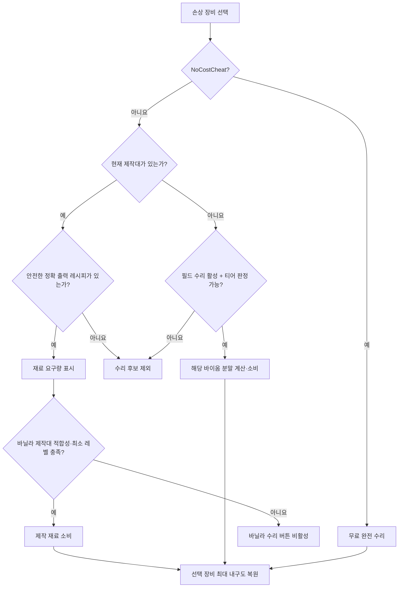

# RepairRequiresMaterials 구현 분석

> 기준: 2026-08-04 작업 트리
> 범위: 정적 코드 분석과 실제 Valheim/Jötunn 2.29.2 어셈블리 대상 빌드 검증. 게임 실행 및 멀티플레이 실기 테스트는 포함하지 않음.

## 결론

이 모드는 손상 장비를 선택해 수리하는 기존 재료 수리 기능에 바이옴별 `수리 분말` 경로를 추가한다.

- 제작대가 열려 있으면 정확한 장비 레시피의 재료 경로를 분말보다 우선한다.
- 바닐라 제작대 적합성·사용 가능 상태·최소 레벨 검사를 통과하지 못하면 재료 요구량은 표시하되 수리는 비활성화한다.
- 제작대가 전혀 없을 때만 장비 티어에 맞는 수리 분말을 플레이어 인벤토리에서 자동 선택해 소비한다.
- 두 경로 모두 선택한 장비를 한 번에 최대 내구도로 복원한다.
- Jötunn은 프리팹·레시피·현지화 등록과 목재 패널 배경에만 사용한다.
- ValheimEnchantmentSystem의 기본 resource map 방식은 내부 로직으로 옮겼으며 VES 자체는 의존하지 않는다.

## 의존성과 등록 방식

| 항목 | 내용 |
|---|---|
| BepInEx | 5.4.2333 이상 |
| Jötunn | 2.29.2 이상, hard dependency |
| ServerSync | 최종 DLL에 병합 |
| AzuCraftyBoxes | soft dependency |

Jötunn의 `PrefabManager.OnVanillaPrefabsAvailable` 시점에 `PowderedDragonEgg`를 복제한다. 등록 목록은 설정과 무관하게 항상 동일한 9개이므로 서버와 클라이언트의 네트워크 prefab hash가 안정적으로 유지된다. Jötunn DLL은 ILRepack 대상에 넣지 않는다.

## 수리 분말

각 제작은 분말 4개를 만들며, 모든 분말은 무게 `0.1`, 최대 스택 `50`, `Material` 타입이다.

| 티어 | 프리팹 | 기본 레시피 |
|---|---|---|
| 목초지 | `RRM_RepairPowder_Meadows` | Resin 4, Workbench 1 |
| 검은 숲 | `RRM_RepairPowder_BlackForest` | Bronze 1, Forge 1 |
| 늪 | `RRM_RepairPowder_Swamp` | Iron 1, Forge 2 |
| 대양 | `RRM_RepairPowder_Ocean` | Chitin 1, Workbench 2 |
| 산 | `RRM_RepairPowder_Mountain` | Obsidian 2, Forge 3 |
| 평원 | `RRM_RepairPowder_Plains` | BlackMetal 1, Forge 4 |
| 안개 지대 | `RRM_RepairPowder_Mistlands` | Eitr 1, BlackForge 1 |
| 잿가루 지대 | `RRM_RepairPowder_AshLands` | ProustitePowder 1, BlackForge 3 |
| 북부 심층 | `RRM_RepairPowder_DeepNorth` | 기본 레시피 없음 |

복제 후 각 렌더러의 material을 분리해 바이옴 색상을 적용하고, particle 색상과 아이콘도 별도로 생성한다. 전용 서버처럼 아이콘 렌더링이 불가능하면 상속된 아이콘을 유지한다.

## 자동 티어 판정

장비 티어는 다음 우선순위로 결정한다.

1. `Item Biome Overrides`의 정확한 장비 매핑
2. 장비의 정확한 출력 프리팹과 일치하는 모든 활성 레시피. 활성 레시피가 하나도 없으면 드롭·상점 장비용 비활성 레시피를 fallback으로 사용
3. 각 레시피에서 `Ingredient Biome Overrides`
4. VES에서 옮긴 기본 재료→바이옴 맵

여러 재료나 대체 레시피가 매핑되면 진행 순위가 가장 높은 바이옴을 사용한다. 일부 재료를 모르는 경우 알려진 재료만으로 판정하며, 전부 알 수 없으면 필드 수리 후보에서 제외한다.

Valheim의 `ObjectDB.GetRecipe(item)`은 같은 표시 이름을 가진 첫 레시피를 반환하므로 모드 장비끼리 충돌할 수 있다. 공용 recipe catalog가 `ObjectDB.m_recipes`를 정확한 출력 프리팹 기준으로 인덱싱한다. 제작대 재료 미리보기는 현재 제작대에서 바로 수리 가능한 안전한 활성 레시피, 제작대 종류가 맞는 안전한 활성 레시피, 첫 안전한 활성 레시피 순으로 고른다. 활성 레시피가 하나도 없을 때만 안전한 비활성 레시피에 같은 순서를 적용한다. 현재 제작대 조건과 맞지 않는 후보는 `StationReady=false`로 요구량만 표시하고 소비하지 않는다. 제작대 적합성은 월드 레벨 예외를 포함한 바닐라 `InventoryGui.CanRepair` 규칙을 따르며, 최소 제작대 레벨 검사는 항상 적용한다. 분말 티어는 모든 활성 대체 레시피 중 가장 높은 바이옴을 사용한다.

`ObjectDB.Awake`, `CopyOtherDB`, `UpdateRegisters` 뒤에는 티어 캐시를 무효화해 Jötunn 및 다른 모드의 지연 레시피 등록을 반영한다.

## 결제 경로



제작대 수리 비용식은 기존 구현을 유지한다.

```text
내구도 구간 = ceil(현재 내구도 비율 × 10) × 10

필요 재료량 = RoundToInt(
    현재 품질의 제작 재료량
    × Repair Material Percent / 100
    × (1 - 내구도 구간 / 100)
)
```

분말 수량은 연속 손상률을 사용한다.

```text
필요 분말 = ceil(손실 내구도 비율 / 분말 1개의 내구도 담당 비율)
```

기본값 25%에서는 1~4개를 소비한다. 분말은 플레이어 인벤토리에서 정확한 prefab 이름으로만 세고 제거하므로 같은 표시 이름의 다른 아이템이 대신 소모되지 않는다. AzuCraftyBoxes 연동은 제작대 재료 수리에만 적용한다.

수리 직전 대상 장비와 결제 종류·바이옴·필요량을 다시 계산한다. 화면에 표시된 계획과 달라졌으면 소비하지 않고 다시 시도하도록 안내한다.

일반 인벤토리와 AzuCraftyBoxes 모두 소비 전 계획을 다시 검증한다. 소비 시작 전 실패는 수리를 취소한다. 외부 패치나 컨테이너 오류가 소비 도중 발생하면 이미 빠진 재료를 완전하게 롤백할 수 없으므로, 재료만 잃는 상황을 피하기 위해 선택 장비의 수리를 완료하고 경고를 기록한다. 내구도를 먼저 복원한 다음 스킬·효과·메시지를 예외 격리된 후처리로 실행한다.

## UI 범위

STUWard에서 참고한 요소는 뒤 배경의 목재 질감과 테두리 모양뿐이다.

- 패널을 `320×280`으로 압축하고 헤더·간격·재료 영역도 함께 줄였다. 장비 선택, 내구도 바, 재료 행, TMP 글꼴과 색상은 유지한다.
- 배경 root만 Jötunn `GUIManager.CreateWoodpanel(..., draggable: false)`로 생성한다.
- 위치는 수리 버튼의 오른쪽 위를 기준으로 잡아 수리 버튼 위·왼쪽 영역에 펼친다. 화면 보정 뒤에도 패널 하단을 버튼 위로 되돌려 서로 겹치지 않게 한다.
- 다른 모드의 교차 칼 아이콘은 탐색하거나 수정하지 않는다.
- 제작대가 없어 바닐라 수리 UI가 비활성화돼도 패널이 보이도록 항상 존재하는 inventory root 아래에 둔다.
- 제작대가 없는 필드 수리에서는 `InventoryGui.UpdateRepair` 뒤에 숨겨진 바닐라 수리 패널·선택 표시·버튼을 복원한다. 같은 바닐라 버튼 클릭을 분말 결제 경로로 전달하며 별도 분말 버튼은 만들지 않는다.
- 대형 모드팩과 주변 상자 조회 비용을 줄이기 위해 recipe는 ObjectDB 단위로 캐시하고, 패널 보유량 갱신은 최대 약 0.15초 간격으로 제한한다. 클릭 시에는 항상 즉시 재계산한다.

## 설정

| 키 | 기본값 | 역할 |
|---|---:|---|
| `Repair Material Percent` | 50 | 제작대 수리의 기본 재료 비율 |
| `Enable Field Repair` | On | 제작대 밖 분말 수리 허용 |
| `Durability Repaired Per Powder` | 25 | 분말 1개가 담당하는 최대 내구도 비율 |
| `Item Biome Overrides` | 빈 값 | `ItemPrefab=Biome` 직접 지정 |
| `Ingredient Biome Overrides` | 빈 값 | `IngredientPrefab=Biome` 직접 지정 |
| `Use AzuCraftyBoxes Containers` | On | 제작대 재료 수리에 주변 상자 포함 |
| `Show Repair Tooltip` | On | 수리 툴팁 표시 |
| `Show Available Amounts` | On | 보유량/필요량 표시 |

현재 설정은 모두 ServerSync 동기화 대상이다. 분말 prefab 목록 자체는 설정으로 켜고 끄지 않는다.

## 주요 파일

| 파일 | 역할 |
|---|---|
| `RepairPowderRegistry.cs` | 분말 복제, 레시피, 색상, 아이콘, 영·한 현지화 |
| `RepairTierResolver.cs` | VES 기반 바이옴 맵, 정확한 recipe scan, override, 캐시 |
| `RepairCostSystem.cs` | 제작대/필드 결제 계획과 수량 계산·소비 |
| `RepairService.cs` | 수리 직전 재검증과 선택 장비 복원 |
| `RepairPanel.cs` | 압축 패널 구성, 선택 상태, Jötunn 목재 배경, 바닐라 버튼 내비게이션·툴팁 |
| `Patches.cs` | InventoryGui 수리 교체, 필드 수리 시 바닐라 컨트롤 복원, ObjectDB 캐시 무효화 |
| `Plugin.cs` | 의존성, 동기화 설정, 등록 초기화 |

## 검증 상태와 남은 런타임 확인

- Jötunn 2.29.2와 현재 설치된 Valheim publicized assemblies를 참조해 Debug/Release 재빌드 성공
- nullable 포함 모든 컴파일 경고를 오류로 처리한 빌드 성공
- ILRepack은 모드 본체와 ServerSync만 병합하며 Jötunn 참조는 외부로 유지됨
- Thunderstore manifest에 BepInEx 5.4.2333 및 Jötunn 2.29.2 의존성 반영
- Thunderstore/Nexus `0.1.0` ZIP 생성과 패키지 내부 manifest 검증 성공

아직 실제 게임에서 확인해야 하는 항목은 해상도/UI 배율별 패널 위치, 게임패드 진입 경로, 싱글·전용 서버의 prefab 동기화, 각 분말 recipe 노출, AzuCraftyBoxes 버전별 소비 동작이다.
